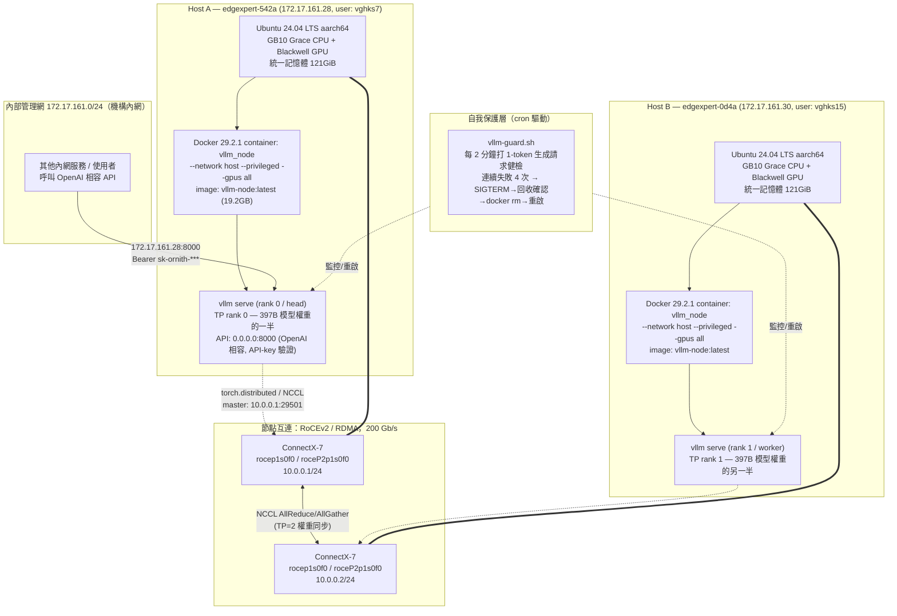
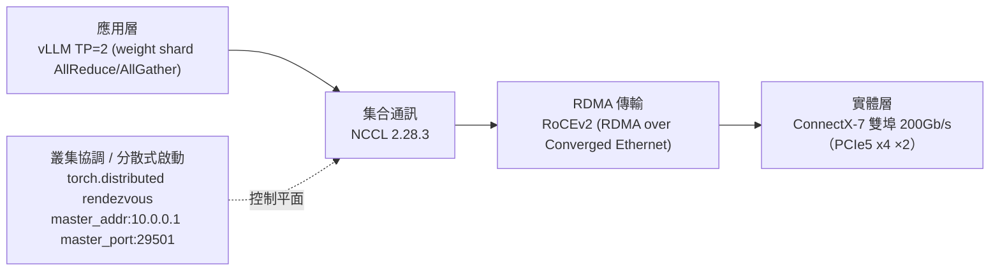

# LLM Infra Audit — Ornith-1.0 Dual-Node DGX Spark Cluster

稽核日期：2026-08-24（第二輪擴充稽核）｜ 方式：唯讀 SSH 遠端探查 ｜ 未存取模型輸出、未動用 API key、未修改遠端系統

## TL;DR

兩台 **NVIDIA DGX Spark（GB10 Grace Blackwell Superchip）**，用雙 ConnectX-7 網卡以
**200Gb/s RoCEv2（RDMA over Converged Ethernet）** 直連，跑開源部署工具
**[`eugr/spark-vllm-docker`](https://github.com/eugr/spark-vllm-docker)**，以
**vLLM 無 Ray、原生 NCCL 的多節點 Tensor-Parallel（`-tp 2 --nnodes 2`）** 方式
共同載入一個自建的 **397B 參數、512-expert MoE、多模態模型「Ornith-1.0」**
（架構衍生自 Qwen3.5-MoE），以 **AutoRound INT4 (W4A16)** 量化後磁碟佔用 196GB，
剛好塞進兩台機器合計 ~240GB 的 LPDDR5x 統一記憶體。**vLLM 執行檔本身被兩道自訂
原始碼補丁改過**（讓它支援以絕對 GiB 數指定顯存配額），對外開 OpenAI 相容 API
（帶金鑰驗證），並用 cron + 自寫 watchdog 腳本做開機自啟與健康檢查自動重啟。
GPU 時脈鎖定、earlyoom 等額外保護機制**工具鏈支援但實際未啟用**（見第 9 節）。

---

## 1. 整體架構圖



**重點**：對外服務入口只有 Host A 的 `:8000`；Host B 純粹提供「另一半權重 + 另一半算力」，
兩台透過**私有的 10.0.0.0/24 RDMA 網段**（與 172.17.161.x 對外網完全分開）做 tensor-parallel
的 all-reduce / all-gather 通訊；一個 cron 驅動的 watchdog 持續監看兩節點健康狀態。

---

## 2. 硬體規格

| | Host A | Host B |
|---|---|---|
| SSH | `vghks7@172.17.161.28` | `vghks15@172.17.161.30` |
| Hostname | `edgexpert-542a` | `edgexpert-0d4a` |
| 型號 | NVIDIA DGX Spark (GB10 Grace Blackwell Superchip) | 同左 |
| CPU/GPU | ARM (aarch64) Grace CPU + Blackwell GPU，**CPU/GPU 共用同一塊 LPDDR5x 統一記憶體**（無獨立顯存，故 `nvidia-smi` 顯示 `Memory-Usage: Not Supported`） | 同左 |
| 統一記憶體 | 實測 `free -h` = 121GiB 可用（`MemTotal` 127,535,252 kB） | 同左（型號一致） |
| GPU 時脈（實測） | current 2483MHz / max 3003MHz，**未鎖定**（見第 9 節） | 同左 |
| OS | Ubuntu 24.04.4 LTS | 同左 |
| Kernel | `6.17.0-1026-nvidia` | 同左 |
| Driver / CUDA | 580.159.03 / CUDA 13.0 | 同左 |
| 對外網卡 | `enP7s7`：172.17.161.28/24（機構內網，DHCP） | `enP7s7`：172.17.161.30/24 |
| 節點互連網卡 | ConnectX-7，4 port（`rocep1s0f0/f1`, `roceP2p1s0f0/f1`），本案僅用 2 port（"non-mesh" 模式） | 同左 |
| 互連 IP | `enp1s0f0np0` = **10.0.0.1/24** | `enp1s0f0np0` = **10.0.0.2/24**（已由 2026-07-21 部署日誌 `397b-launch5.log` 確認："Launching worker (rank 1) on 10.0.0.2..."） |
| 互連頻寬 | 200 Gb/s（`ethtool`/`nvidia-smi topo -m` 確認） | 同左 |
| GPU↔NIC 拓撲 | `NODE`（同 NUMA、經 PCIe host bridge，非 NVLink） | 同左 |
| Swap | 15GB swap file (`/swap.img`)，swappiness=60（Ubuntu 預設值，未針對此負載調整） | 同左 |

### DGX Spark ConnectX 特性（重要，複製到別台機器時必看）

一張 QSFP 埠背後其實是 **2 條 PCIe 5.0 x4 通道**，各自對應一組 Ethernet + RoCE 介面（"twins"）。
只需要在其中一個 twin 上配 IP（給 NCCL 的 out-of-band 協商用），但要拿到滿速 200Gb/s，
NCCL 必須同時使用兩個 RoCE twin（`NCCL_IB_HCA=<if1>,<if2>`）—— 這是 `launch-cluster.sh`
auto-detect 會自動做的事，手動配置時容易漏掉導致頻寬腰斬到 100Gb/s。

---

## 3. 節點互連協定棧



- **應用層**：vLLM 用 `-tp 2` 把 397B 模型的權重矩陣切兩半，兩顆 GPU 各持一半，
  每次前向傳播需要跨節點做 tensor-parallel all-reduce（同步中間結果）。
- **集合通訊層**：NCCL `2.28.3-1`（容器內建），透過以下環境變數指定走 RDMA 而非慢速 TCP socket：
  ```
  NCCL_IB_HCA=rocep1s0f0,roceP2p1s0f0
  NCCL_IB_DISABLE=0
  NCCL_SOCKET_IFNAME=enp1s0f0np0     # rendezvous/控制訊息走這張
  GLOO_SOCKET_IFNAME=enp1s0f0np0
  UCX_NET_DEVICES=enp1s0f0np0
  TP_SOCKET_IFNAME=enp1s0f0np0
  NCCL_IGNORE_CPU_AFFINITY=1         # Grace CPU NUMA 拓撲特殊，需忽略預設親和性判斷
  ```
- **傳輸層**：RoCEv2（`ibv_devinfo` 確認 `link_layer: Ethernet`，非傳統 InfiniBand），
  `active_mtu: 1024`（實測值，DGX Spark 文件建議可調到 jumbo frame `mtu 9000` 以提升吞吐）。
- **控制平面**：分散式進程群組用 PyTorch `torch.distributed` 原生 rendezvous
  （**不是** Ray），`master_addr=10.0.0.1`（Host A 的互連 IP）、`master_port=29501`。

---

## 4. 主機層級安裝的特殊套件

這些是**作業系統層級** apt 套件，跟容器內的 Python/vLLM 套件是兩回事，兩節點一致：

| 套件 | 版本 | 用途 |
|---|---|---|
| `docker-ce` / `docker-ce-cli` / `containerd.io` | 29.2.1 / 29.2.1 / 2.2.1 | 標準 Docker CE |
| `docker-compose-plugin` | 5.0.2 | （目前部署未使用 compose，工具鏈用純 `docker run`） |
| **`nv-docker-gpus`** | 25.08-1 | **NVIDIA 專為 DGX Spark 提供的 GPU-in-Docker 整合套件**（非標準 `nvidia-container-toolkit`，是 DGX OS 專屬包） |
| **`nv-docker-options`** | 25.05-1 | NVIDIA DGX Docker 預設選項套件 |
| `rdma-core` | 50.0-2 | RDMA 核心使用者空間函式庫 |
| `ibverbs-providers` / `libibverbs1` / `libibverbs-dev` | 50.0-2 | InfiniBand Verbs API（RoCE 走這套） |
| `libibmad5` / `libibumad3` | 50.0-2 | IB 管理協定函式庫 |
| `perftest` | 24.01.0 | `ib_write_bw`/`ib_write_lat` 等 RDMA 頻寬/延遲測試工具 |
| `srptools` | 50.0-2 | SCSI RDMA Protocol 工具（本案用不到，隨套件組安裝） |
| **`dgx-spark-mlnx-hotplug`** | 26.01-1 | **DGX Spark 專屬**：ConnectX 熱插拔處理 |
| **`nvidia-spark-mlnx-firmware-manager`** | 5.0.8-1 | **DGX Spark 專屬**：Mellanox 網卡韌體管理 |
| `nvidia-mlnx-tools` | 23.04 | Mellanox 網卡調校工具（`mlxconfig` 等） |
| `mlnx-pxe-setup` | 25.05-1 | Mellanox PXE 開機設定 |

**還原重點**：標記「DGX Spark 專屬」的套件不是標準 Ubuntu repo 有的東西，來自 NVIDIA 的
DGX OS / Spark 專屬 apt source（機器出廠或跑過官方 setup 腳本才會有）。在非 DGX Spark 的
一般 GB10 機器上重建時，這幾個套件可能裝不到或不需要，但 `rdma-core`/`ibverbs-*`/`perftest`
這組標準 RoCE 使用者空間工具是必要的（`sudo apt install rdma-core ibverbs-utils perftest`）。

---

## 4a. Docker 容器內部完整解剖

`docker inspect` + `docker history` + `docker exec` 逐層拆解 `vllm-node:latest` image（兩節點一致）：

### Image 建置系譜

```
ubuntu:24.04（官方 base）
  └─ nvidia/cuda:13.0.2-devel-ubuntu24.04（NVIDIA 官方 CUDA devel image，NVARCH=sbsa 即 ARM 伺服器版）
       └─ + libcudnn9-cuda-13、cuda-*-dev-13-0 全套 CUDA 開發工具鏈（含 nsight-compute，非僅 runtime）
       └─ + apt: python3/pip/dev、vim、curl、git、wget、libibverbs1/dev、rdma-core、libxcb1、earlyoom
       └─ + 本地 .deb 套件覆蓋安裝 NCCL 2.28.3（/workspace/nccl-pkg/*.deb，覆蓋掉 pip 版 libnccl.so.2，
           改連結到 apt 版 —— 這步是 RDMA/RoCE 能正常運作的關鍵，pip 版 NCCL 通常沒編譯 RDMA transport）
       └─ + uv pip: torch==2.11.0 生態系（torchvision/torchaudio/triton）@ PyTorch cu130 index
       └─ + uv pip install /workspace/wheels/*.whl（**自建的 vLLM wheel**，見下方 build-metadata）
       └─ + uv pip: ray[default]、fastsafetensors、instanttensor（build 完後 wheels/ 已清空，不留在最終 image）
       └─ + 預先下載 tiktoken 編碼檔（o200k_base / cl100k_base，離線環境用）
```

### 精確建置版本（`/workspace/build-metadata.yaml`，可用來重新 checkout 完全相同版本）

```yaml
build_date: 2026-07-11T17:58:48Z
vllm_version: 0.23.1rc1.dev1043+ga4b4b5787.d20260711
vllm_commit: a4b4b57872da31bf82291a04e04908f576bdc529
flashinfer_commit: 1aca0f887b65f2ba2bc5e9e9d35ff0bd078da76d
gpu_arch: 12.1a          # Blackwell sm_121a，GB10 專屬 compute capability
build_args:
  vllm_ref: main
  transformers_5: true
```

### 容器內部關鍵事實

| 項目 | 值 |
|---|---|
| Base OS（容器內） | Ubuntu 24.04.3 LTS（跟 host 的 24.04.4 差一個小版號，正常） |
| Python | 3.12.3，套件管理用 `uv`（非純 pip，`UV_SYSTEM_PYTHON=1` 直接裝進系統環境） |
| 原始 `ENTRYPOINT` | `/opt/nvidia/nvidia_entrypoint.sh`（NVIDIA 官方 CUDA image 標準 entrypoint，`launch-cluster.sh` 用 `--entrypoint=` 清空它，改跑 `sleep infinity`） |
| 原始 `WORKDIR` | `/workspace/vllm` |
| pip 套件總數 | **215 個**（完整清單見 [`appendix/container-pip-freeze.txt`](./appendix/container-pip-freeze.txt)） |
| `/workspace/` 內容 | `vllm/`（原始碼樹）、`mods/`（見第 7 節補丁）、`build-metadata.yaml`、`exec-script.sh`（見下方） |

### 幾個容易被忽略、但決定「能不能跑」的關鍵套件

| 套件 | 版本 | 為什麼重要 |
|---|---|---|
| `instanttensor` | 0.1.9 | 就是 `--load-format instanttensor` 的來源，**PyPI/自建 wheel 可安裝的真實套件**，不是 vLLM 內建功能 |
| `fastsafetensors` | 0.3.3 | GPU Direct Storage 式的 safetensors 快速載入，配合 instanttensor 加速 397B 模型讀取 |
| `nvidia-nvshmem-cu13` | 3.4.5 | NVSHMEM，NVIDIA 的 GPU 間共享記憶體通訊庫，多節點 kernel 級通訊會用到 |
| `ray` | 2.56.0 | **已安裝但本部署未啟用**（`RAY_ARGS=--no-ray`）；image 同時支援 Ray 模式與純 torch.distributed 模式，靠 recipe/CLI flag 切換 |
| `triton` | 3.6.0 | flashinfer/vLLM 的 JIT kernel 編譯後端 |
| `tilelang` | 0.1.9 | 另一套 GPU kernel DSL/編譯器（配合 `~/.tilelang` cache 掛載） |
| `apache-tvm-ffi` | 0.1.9 | TVM FFI，供上述 JIT 編譯生態系互通用 |

### `/workspace/exec-script.sh`：真正被執行的那份腳本（關鍵新證據）

這個檔案是 `launch-cluster.sh` 在 `--launch-script`（recipe 模式）下，把 recipe 渲染出的指令
`docker cp` 進容器的最終產物，**兩節點分別各自的版本**應該要被 `make_node_script()` 依節點
角色改寫成不同的 `--node-rank`。實際抓下來比對：

```diff
Host A (head)   ends with: -tp 2 --nnodes 2 --node-rank 0 --master-addr 10.0.0.1 --master-port 29501
Host B (worker) ends with: -tp 2 --nnodes 2 --node-rank 0 --master-addr 10.0.0.1 --master-port 29501
                                              ^^^^^^^^^^^^ 完全相同,理論上應為 --node-rank 1 --headless
```

**兩節點的 `exec-script.sh` 逐位元組相同**（已用 `docker exec ... cat` 直接讀容器內檔案，非
`ps` 截斷）。這推翻了先前「可能是人工繞過工具鏈手動重啟」的猜測 —— 檔案標頭清楚寫著
`# Generated from recipe: Ornith-397B-W4A16-Phase1`，且路徑正是 `launch-cluster.sh` 自動化流程
會寫入的 `/workspace/exec-script.sh`，代表**這就是自動化流程本身產生的檔案**。真正的問題出在
`make_node_script()` 幫 worker 節點差異化 `--node-rank`/`--headless` 這一步，在這次（以及
7/21 那次，日誌雖然印出「rank 1」但那只是迴圈變數的 echo，並未驗證實際寫入檔案的內容）並未正確生效，
研判是這版工具鏈在「透過 recipe 啟動的多節點 no-Ray 模式」下的一個潛在 bug，而非人為疏失。
服務仍運作正常，可能的解釋包括：vLLM 較新版本本身有额外的 rank 自動協商機制、或是兩個「rank 0」
行程中有一個實際上是以未定義行為 fallback 運作。**這是還原此架構時最值得回報給
`eugr/spark-vllm-docker` 專案的一個發現**，建議還原新環境時實際測試多節點啟動後，務必用
`docker exec vllm_node cat /workspace/exec-script.sh` 在兩節點分別確認產生的檔案內容確實不同。

---

## 5. 部署工具鏈：`spark-vllm-docker`

實機上（`/home/vghks7/spark-vllm-docker`，`git remote origin` 指向
**https://github.com/eugr/spark-vllm-docker**）是一套現成的開源 DGX Spark 多節點
vLLM 部署工具，不是從零手刻的腳本。**要在新機器上還原，第一步就是 clone 這個 repo**。

它提供的核心能力：

| 元件 | 作用 |
|---|---|
| `autodiscover.sh` | 自動偵測 ConnectX 介面（2 埠=非 mesh／4 埠=mesh 模式）、掃網段找其他 GB10 節點、寫入 `.env` |
| `launch-cluster.sh` | 讀 `.env`，SSH 到 worker 節點對稱啟動 `docker run`，注入 NCCL/GLOO/UCX 環境變數；多節點時會幫每個節點產生**各自獨立的 patched 啟動腳本**（見下方 rank 分派時間軸） |
| `run-recipe.sh` / `run-recipe.py` | 把 `recipes/*.yaml` 渲染成實際指令，交給 `launch-cluster.sh` |
| `recipes/*.yaml` | 每個模型一份設定檔，本案對應 **`recipes/ornith-397b-w4a16-phase1.yaml`**（備份見 [`appendix/`](./appendix/)） |
| `mods/*` | **對容器內已安裝 vLLM 原始碼直接下 patch** 的模組化補丁（詳見第 7 節），透過 `docker cp` + 容器內執行 `run.sh` 套用 |
| `Dockerfile` / `build-and-copy.sh` | 建置 `vllm-node` image，並同步到所有節點 |
| `docs/NETWORKING.md` | DGX Spark ConnectX 配線、netplan 範例、NCCL 效能測試方法 |

容器啟動細節（兩節點對稱）：
- `docker run --gpus all --privileged --network host --ulimit nofile=1048576:1048576 --ipc=host --entrypoint= vllm-node:latest sleep infinity`
- 掛載：`~/.cache/huggingface`、`~/.cache/vllm`、`~/.cache/flashinfer`、`~/.triton`、`~/.tilelang`；模型目錄另用 `VLLM_SPARK_EXTRA_DOCKER_ARGS="-v <模型目錄>:/models"` 掛入
- 實際的 `vllm serve ...` 指令是另外用 `docker exec` 常駐執行（**不是**容器 CMD），這是刻意設計 —— 原因見第 9 節看門狗說明

### Rank 分派異常：完整證據鏈與修正後的結論

第 4a 節已透過直接讀取兩節點容器內 `/workspace/exec-script.sh`（比 `ps` 截斷擷取更權威的證據）
確認：**這確實是自動化工具鏈本身產生並複製的檔案，不是人為手動繞過**，但 worker 節點該有的
`--node-rank 1 --headless` 差異化沒有生效，兩節點檔案逐位元組相同。時間軸佐證：

- **2026-07-21（`397b-launch5.log`）**：日誌印出 `Launching worker (rank 1) on 10.0.0.2...`，
  但這只是 shell 迴圈變數的 echo，**並未證明實際寫入 worker 容器的腳本內容也是 rank 1**
  （當時沒有留存 exec-script.sh 可回溯比對）。
- **2026-08-24（本次稽核）**：直接讀到兩節點現存的 `exec-script.sh`，逐位元組相同，皆為
  `--node-rank 0`、無 `--headless`。

**結論（已修正先前「可能是人工手動重啟」的猜測）**：這是 `launch-cluster.sh` 在「recipe +
no-Ray 多節點」路徑下 `make_node_script()` 差異化邏輯的疑似 bug，兩次（07-21 與這次運行中的
08-17）啟動可能都受影響，只是 07-21 沒留下檔案可驗證。服務目前仍正常回應（GPU 已載入權重、
閒置低功耗、API 回 401 而非連線失敗），但無法排除「兩個 rank 0 各自獨立運作、worker 那份
權重從未真的被用於查詢」的隱性風險。**強烈建議**：用第 10 節「還原步驟」重新啟動一次，
並用 `docker exec vllm_node cat /workspace/exec-script.sh` 在兩節點分別確認產生的檔案內容
確實不同，若仍相同，建議回報給 [`eugr/spark-vllm-docker`](https://github.com/eugr/spark-vllm-docker) 專案。

---

## 6. 模型架構：Ornith-1.0-397B-W4A16-AutoRound

| 項目 | 值 |
|---|---|
| `architectures` | `Qwen3_5MoeForConditionalGeneration`（Qwen3.5-MoE 架構的自訓練/微調衍生模型，非官方 Qwen 命名） |
| 模態 | **多模態**：文字 + 圖片（Vision Encoder：27 層 ViT，hidden 1152，patch16，temporal_patch 2） |
| 文字層數 | 60 層，`hidden_size` 4096 |
| 注意力機制 | **混合式**：每 4 層才 1 層 `full_attention`，其餘 45 層是 `linear_attention`（類 Mamba/線性注意力，省 KV cache） |
| MoE | `num_experts` **512**，每 token 只啟用 **10** 個（`num_experts_per_tok`），`moe_intermediate_size` 1024 |
| GQA | `num_attention_heads` 32、`num_key_value_heads` 2、`head_dim` 256 |
| Context | `max_position_embeddings` 262144（256K），本部署以 `--max-model-len 131072`（128K）啟用 |
| Multi-Token Prediction | `mtp_num_hidden_layers` 1（本 recipe 為 "Phase 1 無投機解碼"版，尚未啟用投機解碼） |
| 量化 | **AutoRound INT4**（`bits=4, group_size=128`，對稱量化，`packing_format: auto_gptq`），版本 `autoround 0.13.1`；embedding、MoE gate/shared-expert-gate、vision blocks 等敏感層逐層保留 FP16 |
| 磁碟大小 | 196GB（122 個 `.safetensors` 分片） |
| tie_word_embeddings | `false` |

完整 `config.json` / `generation_config.json` 備份於 [`appendix/`](./appendix/)。

### 為什麼兩台 121GiB 統一記憶體塞得下 397B 模型

- INT4 量化後權重理論值 ≈ 397B × 0.5 byte ≈ **198GB**（實測磁碟 196GB，吻合）
- `-tp 2` 把權重切一半 → 每張 GPU 只需扛 **~99GB** 權重
- 加上 KV cache（`--kv-cache-memory-bytes 4294967296` = 4GB，`fp8` KV cache 進一步省記憶體）、
  CUDA context、vLLM 執行時開銷 → recipe 用 `--gpu-memory-utilization-gb 103`（絕對 GB 值）
- 121GiB 可用記憶體 − 103GB 保留給 vLLM ≈ 剩 ~18GB 給 OS/GNOME 桌面/其他行程；
  recipe 註解提到官方建議值是 108GB（headless 前提），這裡因為裝了 GNOME 桌面才保守調到 103GB

### 特殊載入格式：`--load-format instanttensor`

不是 vLLM 內建標準格式，是 NVIDIA DGX Spark 生態系（vllm-node image 內建的 patch/fork）
提供的自訂快速載入器，目的是加速 397B 這種巨型模型從磁碟載入到統一記憶體的過程。

---

## 7. vLLM 原始碼層級補丁（`mods/`）—— 這就是「參數有沒有調整」的答案

Recipe 的 `mods:` 欄位列出兩個補丁，`run-recipe.sh` 啟動時會把對應目錄 `docker cp` 進容器、
執行裡面的 `run.sh`，**直接改寫容器內已安裝的 vLLM Python 原始碼**（不是改 vLLM 命令列參數
而已，是動了 `site-packages/vllm/` 底下的 `.py` 檔）：

### `mods/gpu-mem-util-gb`（447 行 patch，改 7 個檔案）

vLLM 原生只支援 `--gpu-memory-utilization`（0~1 的**比例**），但 GB10 是統一記憶體架構，
沒有固定「顯存總量」可換算比例（會隨 OS/其他行程動態變化）。這個 mod **新增了一個原生
vLLM 沒有的 CLI 參數 `--gpu-memory-utilization-gb`**，改動範圍：
`vllm/config/cache.py`（新增欄位 + 驗證邏輯）、`vllm/engine/arg_utils.py`（新增 CLI flag）、
`vllm/entrypoints/llm.py`、`vllm/v1/worker/utils.py`（記憶體需求計算邏輯改成用絕對 GiB）、
`vllm/v1/worker/gpu_worker.py`、`vllm/v1/core/kv_cache_utils.py`、`vllm/v1/utils.py`
（錯誤訊息/usage 統計一併更新）。

### `mods/kv-cache-prealloc-cleanup`（改 `gpu_worker.py` + `cache.py`）

1. 讓 CUDA graph 記憶體 profiling 可以用 `VLLM_MEMORY_PROFILER_ESTIMATE_CUDAGRAPHS=0`
   環境變數跳過（recipe 的 `env:` 區塊正是這樣設的）—— 省一段啟動時間，代價是記憶體估算
   較不精確，需要靠 `--gpu-memory-utilization-gb` 手動抓保守值來補償。
2. 移除 vLLM 原本「`gpu_memory_utilization_gb` 不能跟 `kv_cache_memory_bytes` 同時指定」的
   驗證檢查，讓 recipe 可以兩者併用（recipe 確實兩個都有指定）。

**還原重點**：新機器上如果直接用**官方發布版 vLLM**（PyPI 或官方 image），
`--gpu-memory-utilization-gb`、`--kv-cache-memory-bytes` 併用會直接報錯 / 參數不存在。
必須用這套工具鏈的 image + 套用這兩個 mod，或自行改用原生 `--gpu-memory-utilization`
（0~1 比例）重新換算等效值。

---

## 8. 推論服務堆疊

- **容器**：Docker，image `vllm-node:latest`（19.2GB），container 名稱 `vllm_node`，`network_mode: host`
- **引擎**：vLLM `0.23.1rc1.dev1043+ga4b4b5787.d20260711`（自建 dev build，非 PyPI 穩定版，
  且如第 7 節已被本地 patch 過，**不是純淨的上游 vLLM**）
- **相依版本**：`torch 2.11.0+cu130`、`torchvision 0.26.0+cu130`、`torchaudio 2.11.0+cu130`、
  `transformers 5.13.1`、`flashinfer-python 0.6.15`、`NCCL 2.28.3-1`、`CUDA 13.0.2`
- **分散式後端**：原生 PyTorch `torch.distributed`（非 Ray —— `vllm-guard.sh` 註解與兩節點
  各自獨立的 `vllm serve` 行程互相印證）
- **對外埠**：僅 Host A `0.0.0.0:8000`，OpenAI 相容 API，**帶 API key 驗證**
- **啟用功能**：`--enable-prefix-caching`、`--enable-auto-tool-choice --tool-call-parser qwen3_xml`、
  `--reasoning-parser qwen3`、自訂 `chat_template_fixed.jinja`
- **調校用環境變數**：`VLLM_MARLIN_USE_ATOMIC_ADD=1`（MoE Marlin kernel 用原子加法，通常是
  為了修正多 GPU/多 token 併發時的數值競爭問題）、`VLLM_MEMORY_PROFILER_ESTIMATE_CUDAGRAPHS=0`

### 參數調整總表（相對於 vLLM 預設值）

| 參數 | 本部署值 | 說明 |
|---|---|---|
| `--max-model-len` | 131072 | 模型原生支援 262144，砍半換取記憶體餘裕 |
| `--max-num-seqs` | 8 | 同時處理的請求數上限，偏保守（單卡吞吐換穩定性） |
| `--kv-cache-dtype` | fp8 | KV cache 用 FP8 而非預設 auto/fp16，省記憶體 |
| `--max-num-batched-tokens` | 4176 | 每批次 token 上限，配合 `max-num-seqs` 調過 |
| `--gpu-memory-utilization-gb` | 103（非原生參數） | 見第 7 節 |
| `--kv-cache-memory-bytes` | 4294967296 (4GB) | 手動指定 KV cache 大小，非自動計算比例 |
| `VLLM_MARLIN_USE_ATOMIC_ADD` | 1 | 非預設，MoE kernel 數值修正 |
| `VLLM_MEMORY_PROFILER_ESTIMATE_CUDAGRAPHS` | 0 | 非預設，跳過 CUDA graph 記憶體 profiling |

---

## 9. 自我保護機制：現況總覽（哪些真的有開，哪些只是「工具鏈支援」）

| 機制 | 狀態 | 說明 |
|---|---|---|
| **cron 健康檢查 + 自動重啟**（`vllm-guard.sh`） | ✅ **已啟用** | 每 2 分鐘打 1-token 生成請求，連續失敗 4 次才觸發重啟，避免單次抖動誤判；`@reboot` 開機自啟 |
| **優雅停機順序**（先 SIGTERM `vllm serve` 再 `docker stop`） | ✅ **已啟用，是整套架構最重要的地雷知識** | 容器 PID 1 是 `sleep infinity`，`vllm serve` 是另外 `docker exec` 進去跑的子行程。`docker stop` 的 SIGTERM 打不到它，會被 SIGKILL 硬砍，**CUDA context 來不及釋放，導致幾十 GB 記憶體卡在驅動保留區、非重開機無法回收**。這是為什麼容器 CMD 刻意留 `sleep infinity`、vLLM 用 `docker exec` 另外啟動的根本原因。 |
| **故障存證**（重啟前存 `docker logs`/`journalctl`/記憶體快照） | ✅ 已啟用（機制存在，但 `~/vllm-crash-logs/` 目前只有一次 `selftest` 演練紀錄，代表**至今未曾真的觸發過重啟**，服務穩定度不錯或看門狗剛部署不久） | |
| **`nvidia-persistenced`**（GPU 驅動常駐，避免每次 client 連線重新初始化） | ✅ **已啟用**（`active` + `enabled`，兩節點一致） | |
| **GPU 時脈鎖定**（recipe 註解建議 `sudo nvidia-smi -lgc 200,2150` 因應「節點無預警關機」） | ❌ **未啟用** | 實測目前時脈是 2483MHz（近 3003MHz 滿載），未鎖定在保守範圍。代表 recipe 作者曾遇過或預期過電源不穩導致的無預警關機，但**這個緩解手段目前沒有實際套用**，是潛在風險點。 |
| **earlyoom**（`launch-cluster.sh --earlyoom` 選項，OOM 前主動砍行程） | ❌ **未啟用**（兩節點皆未安裝/未執行） | 121GiB 統一記憶體 + 15GB swap，若真的 OOM，依賴 kernel 原生 OOM killer（較不可控，可能砍到不該砍的行程） |
| **swappiness 調整** | ❌ **未調整**（維持 Ubuntu 預設 60） | 對於一個要求低延遲、記憶體吃緊的 GPU 推論服務，一般會建議調低（如 10）減少不必要的 swap-in/out |

**給還原者的具體建議**（工具鏈都支援，只是這套實際部署沒開）：
1. 若目標硬體有電源不穩前科，套用 `sudo nvidia-smi -lgc 200,2150`（GPU 時脈下限、上限鎖定，MHz 單位）並寫進開機腳本。
2. 用 `launch-cluster.sh --earlyoom` 取代預設的 `sleep infinity` 前景行程，讓容器內建 OOM 提前防護。
3. 視負載調整 `vm.swappiness`（`/etc/sysctl.d/`），GPU 推論服務通常建議調低到 10 以下。

---

## 10. 在新硬體上還原此架構（步驟）

> 前提：至少 2 台 NVIDIA DGX Spark（或同等 GB10 統一記憶體 ≥120GB 的機器），
> ConnectX-7 雙埠互連，Ubuntu 24.04。

1. **接線 + 網路**：任一 QSFP 埠對接兩台 Spark；建 `/etc/netplan/40-cx7.yaml`，
   給對應的 `enp1s0f*np*` 介面配同網段靜態 IP（本案用 `10.0.0.0/24`），`sudo netplan apply`；
   可選 `mtu 9000` 提升吞吐。
2. **互相信任 SSH**：兩台之間設定 passwordless SSH（`launch-cluster.sh` 會用 SSH 遙控 worker）。
3. **安裝主機層套件**：`sudo apt install docker.io rdma-core ibverbs-utils perftest`
   （見第 4 節；`nv-docker-gpus`/`dgx-spark-mlnx-*` 是 DGX OS 專屬，非 DGX Spark 機器可跳過，
   改用標準 `nvidia-container-toolkit`）
4. **Clone 工具鏈**：`git clone https://github.com/eugr/spark-vllm-docker`
5. **建置/取得 image**：依 repo 的 `Dockerfile` build，或用 `build-and-copy.sh` 同步到兩節點。
6. **準備模型**：把 `Ornith-1.0-397B-W4A16-AutoRound`（196GB，122 個 safetensors 分片 +
   `config.json`/`chat_template_fixed.jinja`/`tokenizer.json` 等）放到兩節點**各自本機**路徑
   （本案是 `/var/tmp/ornith-models`，非共享檔案系統，兩邊各放一份完整拷貝）。
7. **放入 recipe**：複製 [`appendix/ornith-397b-w4a16-phase1.redacted.yaml`](./appendix/ornith-397b-w4a16-phase1.redacted.yaml)
   到 `spark-vllm-docker/recipes/`，把遮蔽的 API key 換成自己新產生的金鑰。
8. **啟動叢集（務必走這條路徑，不要手動在兩台各別執行同一行指令 —— 見第 5 節的 rank 異常教訓）**：
   ```bash
   export VLLM_SPARK_EXTRA_DOCKER_ARGS="-v /var/tmp/ornith-models:/models"
   ./run-recipe.sh ornith-397b-w4a16-phase1.yaml -n <HostA_IP>,<HostB_IP> -d
   ```
9. **驗證**：`./launch-cluster.sh status`、`curl -H "Authorization: Bearer <key>" http://<HostA>:8000/v1/models`，
   並確認 log 中出現 `Launching worker (rank 1)` 字樣（正常 rank 分派的證據）。
10. **部署看門狗**：把 [`appendix/vllm-guard.sh`](./appendix/vllm-guard.sh) 放到 Host A 家目錄，
    補一份 `vllm-guard.conf`（定義 `MODEL`/`PORT`/`WORKER_IP`/`RECIPE`/`NODES`/`MOUNT`/`API_KEY`/
    `RAY_ARGS`/`EXTRA_ARGS`），依 [`appendix/crontab-host1.txt`](./appendix/crontab-host1.txt) 加入 crontab。
11. **（建議）補齊第 9 節列出「工具鏈支援但原部署未開」的保護機制**：GPU 時脈鎖定、earlyoom、swappiness 調整。

---

## 11. 安全與風險備註

1. **API key 明文暴露**：不只 `ps aux` 可見，**recipe YAML 檔本身就把金鑰寫死在 `command:` 區塊**。
   任何能讀該檔或 `ps aux` 的本機使用者都能取得完整金鑰。建議改用 `.env`/secret file + 執行期注入。
2. 本次稽核用的 SSH 金鑰（`claude-llm-probe`，ed25519，無 passphrase）仍在兩台的
   `~/.ssh/authorized_keys`，**建議稽核結束後移除**。
3. 本文件與所有 appendix 檔案中的 API key 均已完全遮蔽；未取得/未備份 `.env`、`vllm-guard.conf`
   等可能含機敏資訊的設定檔（僅描述其用途與必要變數名稱）。
4. Repo 已設為 **Private**，內含內部 IP、主機名稱、帳號名稱、模型商業資訊，請勿轉為 Public 或外流。
5. **目前線上運行的實例可能存在 rank 分派異常**（見第 5 節），建議儘快用官方路徑重啟一次確認。

---

## 12. 目錄結構

```
README.md                                          本文件
appendix/
  ornith-config.json                                模型 config.json 原始備份
  ornith-generation_config.json                      generation_config.json 原始備份
  ornith-397b-w4a16-phase1.redacted.yaml             實際使用的部署 recipe（API key 已遮蔽）
  vllm-guard.sh                                       開機自啟/健康檢查看門狗腳本原始備份
  vllm-guard.conf.redacted                             看門狗設定檔（API key 已遮蔽，含 NODES/RAY_ARGS 等關鍵參數）
  crontab-host1.txt                                   Host A 的 crontab 原始備份
  observed-live-launch-commands.redacted.txt          稽核當下擷取到的完整執行中指令列（含異常記錄）
  chat_template_fixed.jinja                            模型使用的自訂 chat template 原始備份
  ornith-tokenizer_config.json                         tokenizer 設定原始備份
  ornith-preprocessor_config.json                       圖片前處理設定原始備份
  ornith-processor_config.json                          processor 設定原始備份
  container-pip-freeze.txt                              容器內完整 215 個 pip 套件版本清單
```

`spark-vllm-docker/.env`（工具鏈的網路/節點快取設定檔）**不存在**——確認這套部署每次啟動都是
用 `-n <IPs>` 明確帶入節點清單、即時 auto-detect 網卡，而不是靠一份快取設定檔，還原時無需找這個檔案。

## 13. 方法論

全程僅使用唯讀指令：`uname`、`cat /etc/os-release`、`nvidia-smi`（含 `topo -m`、`-q -d CLOCK,POWER`）、
`docker ps/images/inspect/exec/version ...`、`dpkg -l`、`systemctl is-active/is-enabled`、
`ss -tulpn`、`ps aux` / `ps -eo args ww`、`ip -brief addr` / `ip route`、`rdma link show`、
`ibv_devinfo`、`free -h`、`crontab -l`、`find`/`cat`（讀取 repo 內腳本、recipe、log 檔）、
`curl localhost:8000/v1/models`（僅探測驗證機制，未帶 key 呼叫）。未修改任何遠端系統設定、
未存取模型輸出、未使用 API key、未嘗試 sudo 提權、未重啟任何服務。
