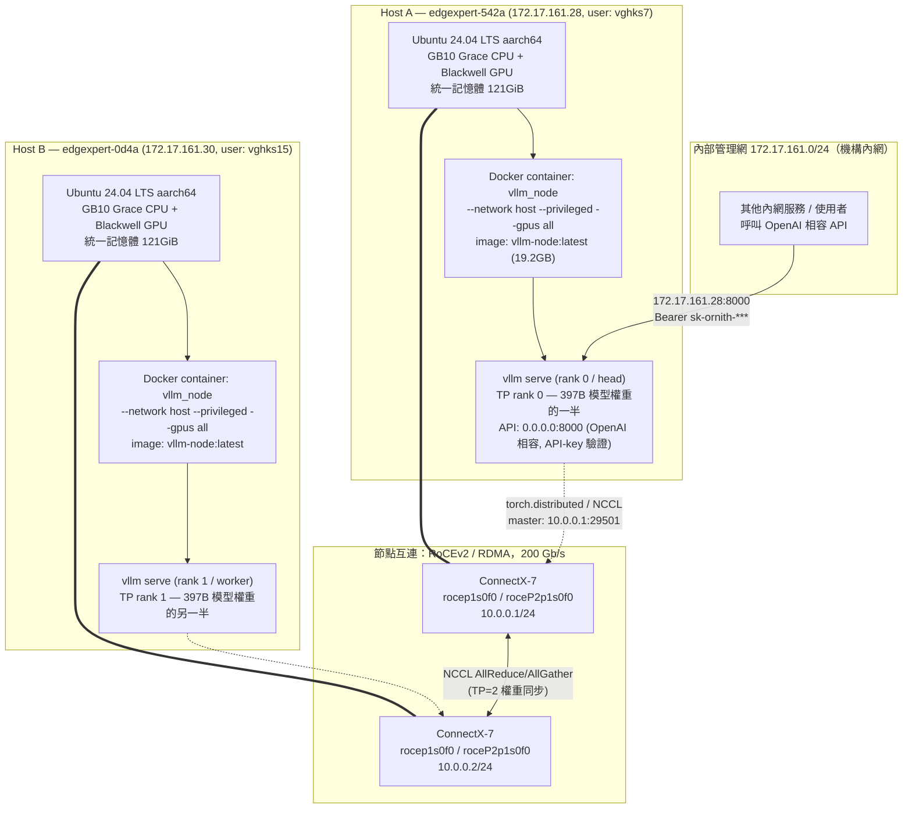
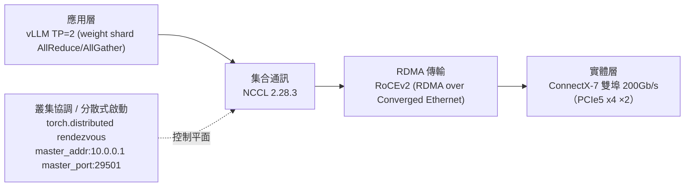

# LLM Infra Audit — Ornith-1.0 Dual-Node DGX Spark Cluster

稽核日期：2026-08-24 ｜ 方式：唯讀 SSH 遠端探查 ｜ 未存取模型輸出、未動用 API key、未修改遠端系統

## TL;DR

兩台 **NVIDIA DGX Spark（GB10 Grace Blackwell Superchip）**，用隨機出貨的雙 ConnectX-7 網卡
以 **200Gb/s RoCEv2（RDMA over Converged Ethernet）** 直連，跑開源部署工具
**[`eugr/spark-vllm-docker`](https://github.com/eugr/spark-vllm-docker)**，以
**vLLM 無 Ray、原生 NCCL 的多節點 Tensor-Parallel（`-tp 2 --nnodes 2`）** 方式
共同載入一個自建的 **397B 參數、512-expert MoE、多模態模型「Ornith-1.0」**
（架構衍生自 Qwen3.5-MoE），以 **AutoRound INT4 (W4A16)** 量化後磁碟佔用 196GB，
剛好塞進兩台機器合計 ~240GB 的 LPDDR5x 統一記憶體。對外由 vLLM 開 OpenAI 相容 API
（帶金鑰驗證），並用 cron + 自寫 watchdog 腳本做開機自啟與健康檢查自動重啟。

---

## 1. 整體架構圖



**重點**：對外服務入口只有 Host A 的 `:8000`；Host B 純粹提供「另一半權重 + 另一半算力」，
兩台透過**私有的 10.0.0.0/24 RDMA 網段**（與 172.17.161.x 對外網完全分開）做 tensor-parallel
的 all-reduce / all-gather 通訊。

---

## 2. 硬體規格

| | Host A | Host B |
|---|---|---|
| SSH | `vghks7@172.17.161.28` | `vghks15@172.17.161.30` |
| Hostname | `edgexpert-542a` | `edgexpert-0d4a` |
| 型號 | NVIDIA DGX Spark (GB10 Grace Blackwell Superchip) | 同左 |
| CPU/GPU | ARM (aarch64) Grace CPU + Blackwell GPU，**CPU/GPU 共用同一塊 LPDDR5x 統一記憶體**（無獨立顯存，故 `nvidia-smi` 顯示 `Memory-Usage: Not Supported`） | 同左 |
| 統一記憶體 | 實測 `free -h` = 121GiB 可用（`MemTotal` 127,535,252 kB） | 同左（型號一致） |
| OS | Ubuntu 24.04.4 LTS | 同左 |
| Kernel | `6.17.0-1026-nvidia` | 同左 |
| Driver / CUDA | 580.159.03 / CUDA 13.0 | 同左 |
| 對外網卡 | `enP7s7`：172.17.161.28/24（機構內網，DHCP） | `enP7s7`：172.17.161.30/24 |
| 節點互連網卡 | ConnectX-7，4 port（`rocep1s0f0/f1`, `roceP2p1s0f0/f1`），本案僅用 2 port（"non-mesh" 模式） | 同左 |
| 互連 IP | `enp1s0f0np0` = **10.0.0.1/24** | `enp1s0f0np0` = 10.0.0.2/24（推測，未逐一複驗） |
| 互連頻寬 | 200 Gb/s（`ethtool`/`nvidia-smi topo -m` 確認） | 同左 |
| GPU↔NIC 拓撲 | `NODE`（同 NUMA、經 PCIe host bridge，非 NVLink） | 同左 |

### DGX Spark ConnectX 特性（重要，複製到別台機器時必看）

一張 QSFP 埠背後其實是 **2 條 PCIe 5.0 x4 通道**，各自對應一組 Ethernet + RoCE 介面（"twins"）：
- `enp1s0f1np1` + `roce p1s0f1`（or f0，依實際接的實體埠而定）
- `enP2p1s0f1np1` + `roceP2p1s0f1`

只需要在其中一個 twin 上配 IP（給 NCCL 的 out-of-band 協商用），但要拿到滿速 200Gb/s，
NCCL 必須同時使用兩個 RoCE twin（`NCCL_IB_HCA=<if1>,<if2>`）—— 這是 `launch-cluster.sh`
auto-detect 會自動做的事，手動配置時容易漏掉導致頻寬腰斬到 100Gb/s。

---

## 3. 節點互連協定棧



- **應用層**：vLLM 用 `-tp 2` 把 397B 模型的權重矩陣切兩半，兩顆 GPU 各持一半，
  每次前向傳播需要跨節點做 tensor-parallel all-reduce（同步中間結果）。
- **集合通訊層**：NCCL `2.28.3-1`（容器內建），透過以下環境變數指定走 RDMA 而非慢速 TCP socket：
  ```
  NCCL_IB_HCA=rocep1s0f0,roceP2p1s0f0
  NCCL_IB_DISABLE=0
  NCCL_SOCKET_IFNAME=enp1s0f0np0     # rendezvous/控制訊息走這張
  GLOO_SOCKET_IFNAME=enp1s0f0np0
  UCX_NET_DEVICES=enp1s0f0np0
  TP_SOCKET_IFNAME=enp1s0f0np0
  NCCL_IGNORE_CPU_AFFINITY=1         # Grace CPU NUMA 拓撲特殊，需忽略預設親和性判斷
  ```
- **傳輸層**：RoCEv2（`ibv_devinfo` 確認 `link_layer: Ethernet`，非傳統 InfiniBand），
  `active_mtu: 1024`（實測值，DGX Spark 文件建議可調到 jumbo frame `mtu 9000` 以提升吞吐）。
- **控制平面**：分散式進程群組用 PyTorch `torch.distributed` 原生 rendezvous
  （**不是** Ray —— 見第 6 節），`master_addr=10.0.0.1`（Host A 的互連 IP）、`master_port=29501`，
  由 vLLM 的 `--nnodes 2 --node-rank <N> --master-addr --master-port` 參數控制。

---

## 4. 部署工具鏈：`spark-vllm-docker`

實機上（`/home/vghks7/spark-vllm-docker`，`git remote origin` 指向
**https://github.com/eugr/spark-vllm-docker**）是一套現成的開源 DGX Spark 多節點
vLLM 部署工具，不是從零手刻的腳本。**要在新機器上還原，第一步就是 clone 這個 repo**，
不需要重寫任何叢集啟動邏輯。

它提供的核心能力：

| 元件 | 作用 |
|---|---|
| `autodiscover.sh` | 自動偵測 ConnectX 介面（2 埠=非 mesh／4 埠=mesh 模式）、掃網段找其他 GB10 節點（用 `nvidia-smi --query-gpu=name` 判斷）、寫入 `.env` |
| `launch-cluster.sh` | 讀 `.env`，用 SSH 到 worker 節點對稱啟動 `docker run`（`--network host --privileged --gpus all`，掛 HF/vLLM/flashinfer/triton/tilelang cache），並注入上一節列出的 NCCL/GLOO/UCX 環境變數；多節點 vLLM 指令會自動幫 worker 追加 `--nnodes N --node-rank <rank> --headless` |
| `run-recipe.sh` / `run-recipe.py` | 把 `recipes/*.yaml`（模型 + 啟動參數的宣告式設定）渲染成上面 `launch-cluster.sh --launch-script` 要吃的實際指令 |
| `recipes/*.yaml` | 每個模型一份設定檔（可量化格式、TP/PP/DP、context length…），本案對應 **`recipes/ornith-397b-w4a16-phase1.yaml`**（見 [`appendix/`](./appendix/)） |
| `Dockerfile` / `build-and-copy.sh` | 建置 `vllm-node` image（含指定版本 vLLM/torch/flashinfer/NCCL），並同步到所有節點 |
| `docs/NETWORKING.md` | DGX Spark ConnectX 配線、netplan 範例、NCCL 效能測試方法（完整內容見下方「還原步驟」引用） |

容器啟動細節（由 `launch-cluster.sh` 決定，兩節點對稱）：
- `docker run --gpus all --privileged --network host --ulimit nofile=1048576:1048576 --ipc=host --entrypoint= vllm-node:latest sleep infinity`
- 掛載：`~/.cache/huggingface`、`~/.cache/vllm`、`~/.cache/flashinfer`、`~/.triton`、`~/.tilelang` → 對應容器內路徑；模型目錄額外用 `VLLM_SPARK_EXTRA_DOCKER_ARGS="-v <模型目錄>:/models"` 掛入
- 實際的 `vllm serve ...` 指令是另外用 `docker exec` 常駐執行（**不是**容器的 CMD/entrypoint），這是刻意設計——見第 7 節看門狗腳本的說明

### ⚠️ 觀測到的異常：兩節點 `--node-rank` 相同

實際擷取到的**執行中**指令（見 [`appendix/observed-live-launch-commands.redacted.txt`](./appendix/observed-live-launch-commands.redacted.txt)），
兩節點逐字相同、都是 `--node-rank 0`、都沒有 `--headless`。但 `launch-cluster.sh` 原始碼中
`exec_no_ray_cluster()` 應該會把 worker 改寫成 `--node-rank 1 --headless`。這代表：
- 這次線上跑的版本**未必**是透過 `launch-cluster.sh` 的自動多節點分派路徑啟動（可能是除錯階段
  手動在兩台個別執行、或用了其他路徑），從唯讀稽核無法百分之百確認實際生效機制；
- 服務本身運作正常（已連續運行 7 天、API 回應正常、GPU 已載入權重且閒置低功耗），只是命令列表面上的 rank 標示可疑；
- **在新機器上重建時，請直接用 `./run-recipe.sh ornith-397b-w4a16-phase1.yaml -n <IP1>,<IP2>` 走官方自動路徑**，
  不要照抄稽核擷取到的「兩邊都 `--node-rank 0`」這行指令。

---

## 5. 模型架構：Ornith-1.0-397B-W4A16-AutoRound

| 項目 | 值 |
|---|---|
| `architectures` | `Qwen3_5MoeForConditionalGeneration`（Qwen3.5-MoE 架構的自訓練/微調衍生模型，非官方 Qwen 命名） |
| 模態 | **多模態**：文字 + 圖片（Vision Encoder：27 層 ViT，hidden 1152，patch16，temporal_patch 2） |
| 文字層數 | 60 層，`hidden_size` 4096 |
| 注意力機制 | **混合式**：每 4 層才 1 層 `full_attention`，其餘 45 層是 `linear_attention`（類 Mamba/線性注意力，省 KV cache） |
| MoE | `num_experts` **512**，每 token 只啟用 **10** 個（`num_experts_per_tok`），`moe_intermediate_size` 1024 |
| GQA | `num_attention_heads` 32、`num_key_value_heads` 2、`head_dim` 256 |
| Context | `max_position_embeddings` 262144（256K），本部署以 `--max-model-len 131072`（128K）啟用 |
| Multi-Token Prediction | `mtp_num_hidden_layers` 1（具投機解碼潛力，本 recipe 為 "Phase 1 無投機解碼"版） |
| 量化 | **AutoRound INT4**（`bits=4, group_size=128`，對稱量化，`packing_format: auto_gptq`），版本 `autoround 0.13.1`；embedding、MoE gate/shared-expert-gate、vision blocks 等敏感層逐層保留 FP16 |
| 磁碟大小 | 196GB（122 個 `.safetensors` 分片） |
| tie_word_embeddings | `false` |

完整 `config.json` / `generation_config.json` 備份於 [`appendix/`](./appendix/)。

### 為什麼兩台 121GiB 統一記憶體塞得下 397B 模型

- INT4 量化後權重理論值 ≈ 397B × 0.5 byte ≈ **198GB**（實測磁碟 196GB，吻合）
- `-tp 2` 把權重切一半 → 每張 GPU 只需扛 **~99GB** 權重
- 加上 KV cache（`--kv-cache-memory-bytes 4294967296` = 4GB，`fp8` KV cache 進一步省記憶體）、
  CUDA context、vLLM 執行時開銷 → recipe 用 `--gpu-memory-utilization-gb 103`（絕對 GB 值，
  不是常見的 0~1 分數，因為 GB10 統一記憶體沒有固定的「顯存總量」可供 vLLM 自動偵測百分比）
- 121GiB 可用記憶體 − 103GB 保留給 vLLM ≈ 剩 ~18GB 給 OS/GNOME 桌面/其他行程，
  recipe 註解也提到官方建議值是 108GB（headless 前提），這裡因為裝了 GNOME 桌面才保守調到 103GB

### 特殊載入格式：`--load-format instanttensor`

不是 vLLM 內建標準格式（標準只有 `auto`/`safetensors`/`bitsandbytes` 等），是 NVIDIA
DGX Spark 生態系（`spark-vllm-docker` 或其依賴的 vLLM fork/patch）提供的自訂快速載入器，
目的是加速 397B 這種巨型模型從磁碟載入到統一記憶體的過程。還原環境時需確保用的是同一個
`vllm-node` image（見第 4 節 Dockerfile），標準 vLLM release 不一定認得這個 load-format。

---

## 6. 推論服務堆疊

- **容器**：Docker，image `vllm-node:latest`（19.2GB），container 名稱 `vllm_node`，`network_mode: host`
- **引擎**：vLLM `0.23.1rc1.dev1043+ga4b4b5787.d20260711`（自建 dev build，非 PyPI 穩定版）
- **相依版本**：`torch 2.11.0+cu130`、`torchvision 0.26.0+cu130`、`torchaudio 2.11.0+cu130`、
  `transformers 5.13.1`、`flashinfer-python 0.6.15`、`NCCL 2.28.3-1`、`CUDA 13.0.2`
- **分散式後端**：原生 PyTorch `torch.distributed`（**非 Ray** —— `vllm-guard.sh` 註解特別提到
  "ray 模式的 worker 沒有 vllm serve"，而兩節點都確實各自跑著獨立的 `vllm serve` 行程，
  可反向確認本部署走的是 no-Ray 路徑）
- **對外埠**：僅 Host A `0.0.0.0:8000`，OpenAI 相容 API，**帶 API key 驗證**
  （`curl localhost:8000/v1/models` 未帶 key 回傳 `{"error":"Unauthorized"}`，已確認保護生效，
  本次稽核未使用該金鑰呼叫任何推論）
- **啟用功能**：`--enable-prefix-caching`、`--enable-auto-tool-choice --tool-call-parser qwen3_xml`、
  `--reasoning-parser qwen3`、自訂 `chat_template_fixed.jinja`
- **調校用環境變數**（recipe 內建）：`VLLM_MARLIN_USE_ATOMIC_ADD=1`、
  `VLLM_MEMORY_PROFILER_ESTIMATE_CUDAGRAPHS=0`

---

## 7. 高可用性：開機自啟 + 健康檢查看門狗

`crontab -l`（Host A，[`appendix/crontab-host1.txt`](./appendix/crontab-host1.txt)）：
```
@reboot sleep 30 && /bin/bash /home/vghks7/vllm-guard.sh boot
*/2 * * * * /bin/bash /home/vghks7/vllm-guard.sh check
```

`vllm-guard.sh`（完整備份於 [`appendix/vllm-guard.sh`](./appendix/vllm-guard.sh)）核心邏輯：

1. **`boot`**：開機 30 秒後執行，等 worker（Host B）SSH 可連（最多等 10 分鐘，ConnectX 初始化可能較慢）→ 呼叫 `run-recipe.sh` 重新拉起叢集 → 輪詢 `/v1/chat/completions` 直到回 200
2. **`check`**（每 2 分鐘）：送一個 `max_tokens=1` 的最小生成請求當健康檢查，**連續失敗 4 次**才觸發重啟（避免單次抖動誤判）
3. **重啟前必做 graceful stop**：對容器內 `vllm serve` 行程直接送 `SIGTERM`（**不是** `docker stop`）——
   因為容器 PID 1 是 `sleep infinity`，`vllm serve` 是另外 `docker exec` 進去跑的子行程，
   `docker stop` 的訊號打不到它，會被 SIGKILL 硬砍，CUDA context 來不及釋放，導致幾十 GB
   記憶體卡在驅動保留區、非重開機無法回收。**這是整份稽核中最值得記住的地雷**，複製這套架構
   時務必保留這個「先 SIGTERM vllm serve、等記憶體回收、再 docker stop」的順序。
4. **維護模式**：`touch ~/.vllm-guard-off` 可暫停看門狗（做完維護要記得刪除）
5. **故障存證**：重啟前自動保存兩節點的 `docker logs`、`journalctl`（過濾 `nvrm|oom|mlx5|xid` 關鍵字）、記憶體快照到 `~/vllm-crash-logs/<timestamp>/`
6. 有 `selftest` 子命令可以「演練」整套重啟檢查邏輯而不真的動到服務，方便日常驗證看門狗本身是否健全

---

## 8. 在新硬體上還原此架構（步驟）

> 前提：至少 2 台 NVIDIA DGX Spark（或同等 GB10 統一記憶體 ≥120GB 的機器），
> ConnectX-7 雙埠互連，Ubuntu 24.04。

1. **接線 + 網路**：任一 QSFP 埠對接兩台 Spark；依 `docs/NETWORKING.md`
   （[`appendix/`](./appendix/) 未收錄全文，重點見本文件第 2、3 節）在兩邊各建
   `/etc/netplan/40-cx7.yaml`，給對應的 `enp1s0f*np*` 介面配同網段靜態 IP
   （本案用 `10.0.0.0/24`），`sudo netplan apply`；可選 `mtu 9000` 提升吞吐。
2. **互相信任 SSH**：兩台之間設定 passwordless SSH（`launch-cluster.sh` 會用 SSH 遙控 worker）。
3. **Clone 工具鏈**：`git clone https://github.com/eugr/spark-vllm-docker`
4. **建置/取得 image**：依 repo 的 `Dockerfile` build，或用 `build-and-copy.sh` 同步到兩節點；
   確認 image 內 vLLM 版本支援 `--load-format instanttensor`（見第 5 節）。
5. **準備模型**：把 `Ornith-1.0-397B-W4A16-AutoRound`（196GB，122 個 safetensors 分片 +
   `config.json`/`chat_template_fixed.jinja`/`tokenizer.json` 等）放到兩節點都能存取的路徑
   （本案是各自本機 `/var/tmp/ornith-models`，兩邊各放一份完整拷貝，不是共享檔案系統）。
   若要重新產生量化版本，需要原始 bf16 權重 + `auto-round==0.13.1` 跑 AutoRound INT4 量化。
6. **放入 recipe**：複製 [`appendix/ornith-397b-w4a16-phase1.redacted.yaml`](./appendix/ornith-397b-w4a16-phase1.redacted.yaml)
   到 `spark-vllm-docker/recipes/`，把遮蔽的 API key 換成自己新產生的金鑰。
7. **啟動叢集**：
   ```bash
   export VLLM_SPARK_EXTRA_DOCKER_ARGS="-v /var/tmp/ornith-models:/models"
   ./run-recipe.sh ornith-397b-w4a16-phase1.yaml -n <HostA_IP>,<HostB_IP> -d
   ```
   （`autodiscover.sh` 也能自動掃網段找到另一台 GB10，省去手動填 `-n`）
8. **驗證**：`./launch-cluster.sh status`、`curl -H "Authorization: Bearer <key>" http://<HostA>:8000/v1/models`
9. **部署看門狗**：把 [`appendix/vllm-guard.sh`](./appendix/vllm-guard.sh) 放到 Host A 家目錄，
   補一份 `vllm-guard.conf`（定義 `MODEL`/`PORT`/`WORKER_IP`/`RECIPE`/`NODES`/`MOUNT`/`API_KEY`/
   `RAY_ARGS`/`EXTRA_ARGS` 等變數，本次稽核未取得原始 `.conf` 內容，需自行依 script 用到的變數
   重新撰寫），並依 [`appendix/crontab-host1.txt`](./appendix/crontab-host1.txt) 加入 crontab。

---

## 9. 安全與風險備註

1. **API key 明文暴露**：不只 `ps aux` 可見，**recipe YAML 檔本身就把金鑰寫死在 `command:` 區塊**
   （`/home/vghks7/spark-vllm-docker/recipes/ornith-397b-w4a16-phase1.yaml`）。任何能讀該檔或
   `ps aux` 的本機使用者都能取得完整金鑰。建議改用 `.env`/secret file + 執行期注入，不要寫死在
   版本控制中的 recipe 檔案裡。
2. 本次稽核用的 SSH 金鑰（`claude-llm-probe`，ed25519，無 passphrase）仍在兩台的
   `~/.ssh/authorized_keys`，**建議稽核結束後移除**。
3. 本文件與所有 appendix 檔案中的 API key 均已完全遮蔽；未取得/未備份 `.env`、`vllm-guard.conf`
   等可能含機敏資訊的設定檔（僅描述其用途與必要變數名稱）。
4. Repo 已設為 **Private**，內含內部 IP（172.17.161.x 管理網、10.0.0.x RDMA 私網）、主機名稱、
   帳號名稱、模型商業資訊，請勿轉為 Public 或外流。

---

## 10. 目錄結構

```
README.md                                          本文件
appendix/
  ornith-config.json                                模型 config.json 原始備份
  ornith-generation_config.json                      generation_config.json 原始備份
  ornith-397b-w4a16-phase1.redacted.yaml             實際使用的部署 recipe（API key 已遮蔽）
  vllm-guard.sh                                       開機自啟/健康檢查看門狗腳本原始備份
  crontab-host1.txt                                   Host A 的 crontab 原始備份
  observed-live-launch-commands.redacted.txt          稽核當下擷取到的完整執行中指令列（含異常記錄）
```

## 11. 方法論

全程僅使用唯讀指令：`uname`、`cat /etc/os-release`、`nvidia-smi`（含 `topo -m`）、
`docker ps/images/inspect/exec ...`、`ss -tulpn`、`ps aux` / `ps -eo args ww`、
`ip -brief addr` / `ip route`、`rdma link show`、`ibv_devinfo`、`free -h`、`crontab -l`、
`find`/`cat`（讀取 repo 內腳本與 recipe）、`curl localhost:8000/v1/models`（僅探測驗證機制，
未帶 key 呼叫）。未修改任何遠端系統設定、未存取模型輸出、未使用 API key、未嘗試 sudo 提權。
